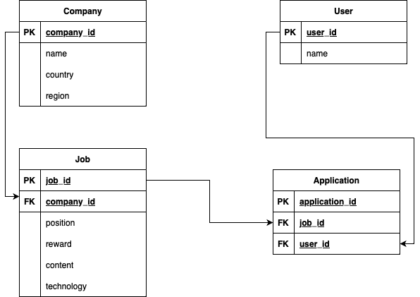

# Intern

### 채용공고

**GET**

채용공고 목록 조회 → /job

```json
[
	{
		"채용공고_id": 채용공고_id,
		"회사명":"원티드랩",
		"국가":"한국",
		"지역":"서울",
		"채용포지션":"백엔드 주니어 개발자",
		"채용보상금":1500000,
		"사용기술":"Python"
	},
	{
		"채용공고_id": 채용공고_id,
		"회사명":"네이버",
		"국가":"한국",
		"지역":"판교",
		"채용포지션":"Django 백엔드 개발자",
		"채용보상금":1000000,
		"사용기술":"Django"
	},
	...
]
```

채용공고 검색 → /job?search=원티드

```json
[
	{
		"채용공고_id": 채용공고_id,
		"회사명":"원티드랩",
		"국가":"한국",
		"지역":"서울",
		"채용포지션":"백엔드 주니어 개발자",
		"채용보상금":1500000,
		"사용기술":"Python"
	},
	{
		"채용공고_id": 채용공고_id,
		"회사명":"원티드코리아",
		"국가":"한국",
		"지역":"부산",
		"채용포지션":"프론트엔드 개발자",
		"채용보상금":500000,
		"사용기술":"javascript"
	}
]
```

채용공고 상세 조회 → /job/id

** 채용내용, 해당 회사가 올린 다른 채용공고 추가

```json
{
	"채용공고_id": 채용공고_id,
	"회사명":"원티드랩",
	"국가":"한국",
	"지역":"서울",
	"채용포지션":"백엔드 주니어 개발자",
	"채용보상금":1500000,
	"사용기술":"Python",
	"채용내용": "원티드랩에서 백엔드 주니어 개발자를 채용합니다. 자격요건은..",
	"화사가올린다른채용공고":[채용공고_id, 채용공고_id, ..]
}
```

**POST**

채용공고 등록 → /job

```json
{
	"회사_id":회사_id,
	"채용포지션":"백엔드 주니어 개발자",
	"채용보상금":1000000,
	"채용내용":"원티드랩에서 백엔드 주니어 개발자를 채용합니다. 자격요건은..",
	"사용기술":"Python"
}
```

채용공고 지원 → /job/id → /application으로 변경

** 1회만 지원 가능

```json
{
	"채용공고_id": 채용공고_id,
	"사용자_id": 사용자_id
}
```

**PUT**

채용공고 수정 → /job/id

** 회사 id 외 모두 수정 가능

```json
{
	"채용포지션":"백엔드 주니어 개발자",
	"채용보상금":1500000,
	"채용내용":"원티드랩에서 백엔드 주니어 개발자를 '적극' 채용합니다. 자격요건은..",
	"사용기술":"Python"
}
```

**DELETE**

채용공고 삭제 → /job/id

**Model**

회사, 사용자, 채용공고, 지원내역


